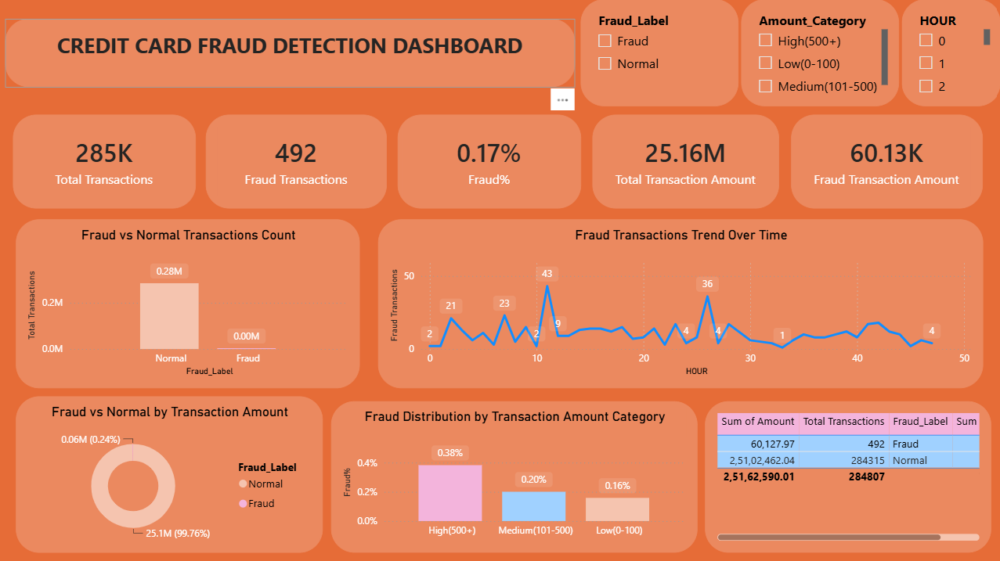
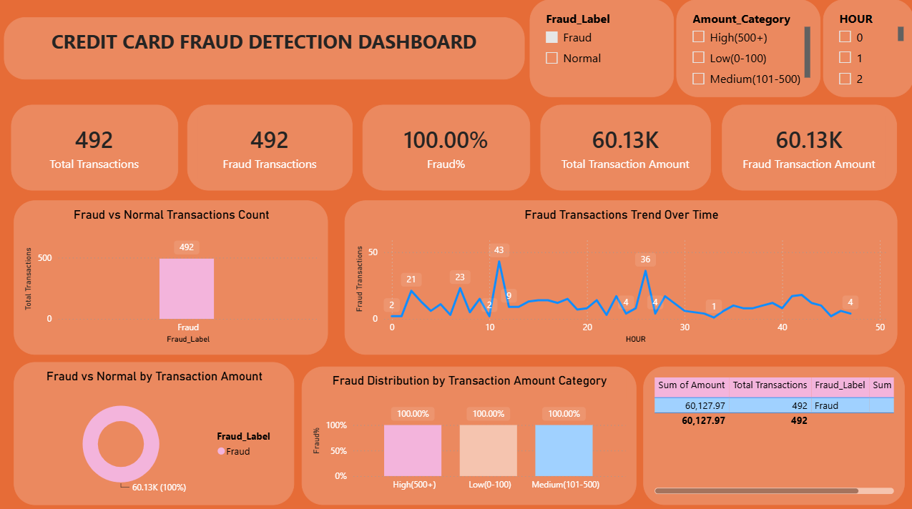
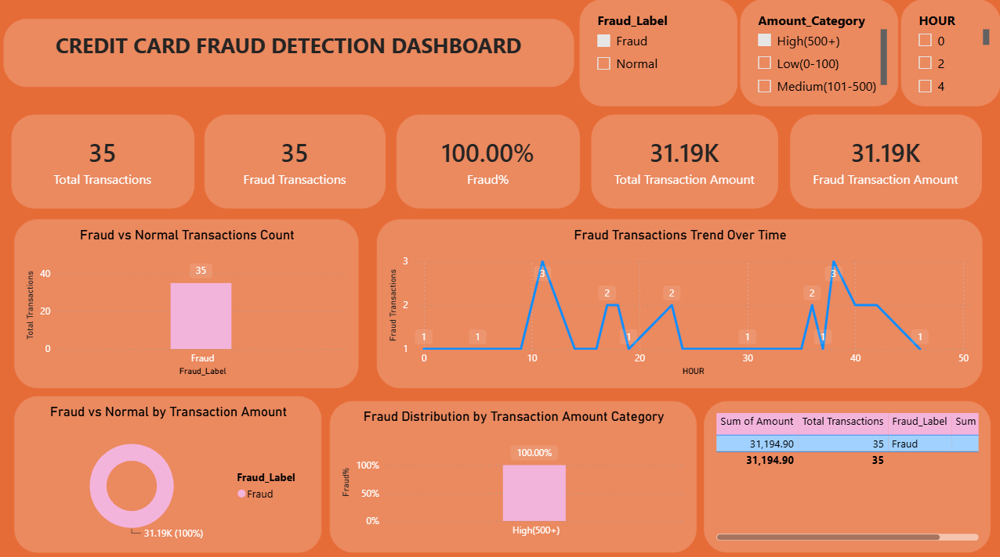
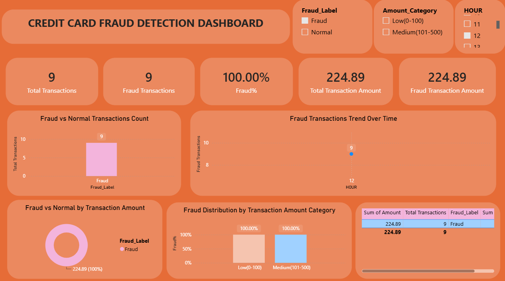
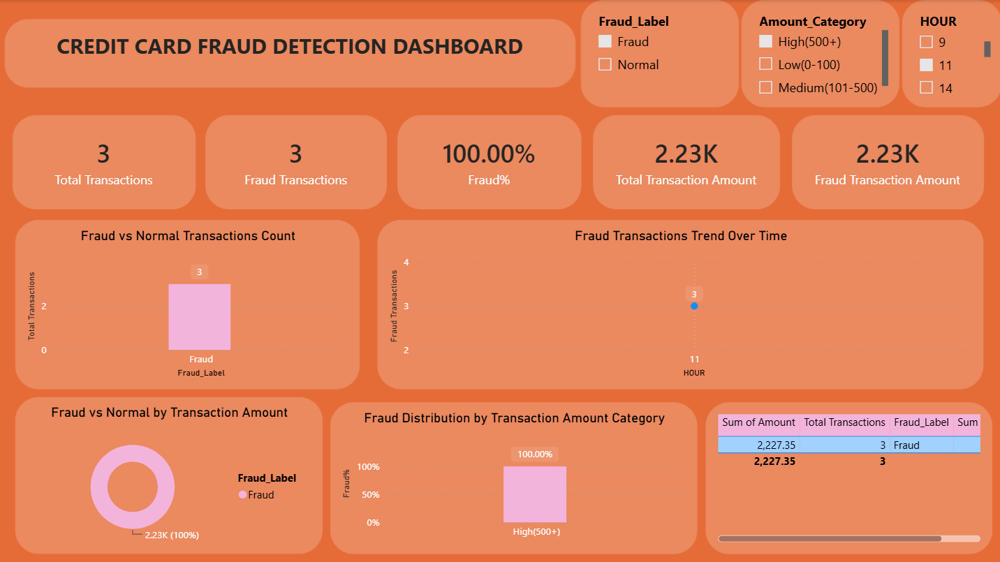

# Credit Card Fraud Detection

An end-to-end Data Science project that detects fraudulent credit card transactions using Data Science Techniques and visualizes insights through Power BI Dashboard.

---

##  Dataset

This project uses the **Credit Card Fraud Detection** dataset from Kaggle.

The dataset contains **284,807** anonymized credit card transactions made by European cardholders over two consecutive days in **September 2013**. Among these transactions, **492 are fraudulent**, representing only **0.172%** of the data, making it a highly imbalanced binary classification problem.

**Dataset Source:** https://www.kaggle.com/datasets/mlg-ulb/creditcardfraud

> **Note:** The dataset is not included in this repository due to its size. Download `creditcard.csv` from Kaggle and place it inside the `data/` directory before running the notebooks.

---

##  Key Features

- **Time** – Seconds elapsed between each transaction and the first transaction in the dataset.
- **Amount** – Transaction amount.
- **V1–V28** – Principal Components (PCA-transformed features) used to preserve customer confidentiality.
- **Class** – Target variable:
  - `0` → Legitimate Transaction
  - `1` → Fraudulent Transaction

---

##  Project Goals

This project aims to perform an end-to-end Data Science workflow for credit card fraud detection by:

- Cleaning and preprocessing the dataset.
- Performing Exploratory Data Analysis (EDA).
- Handling class imbalance.
- Engineering useful features.
- Creating DAX Measures.
- Generating KPI Cards and charts.
- Generating Dashboard Design.
- Building an interactive Power BI dashboard.

---

##  Project Workflow

```text
Raw Dataset
      │
      ▼
Data Cleaning
      │
      ▼
Data Preprocessing
      │
      ▼
Exploratory Data Analysis
      │
      ▼
DAX Measures and KPI
      │
      ▼
Dashboard Visualizations
      │
      ▼
Final Power BI Dashboard
```

---

##  Technologies Used

- Python
- Pandas
- NumPy
- Matplotlib
- Seaborn
- Scikit-learn
- VS Code
- Jupyter Notebook
- DAX Commands
- KPI Cards
- Power BI
- Git & GitHub

---

##  Current Progress

| Stage | Status |
|-------|--------|
| Dataset Collection | ✅ Completed |
| Project Setup | ✅ Completed |
| Data Cleaning | ✅ Completed|
| Data Preprocessing | ✅ Completed |
| Exploratory Data Analysis (EDA) | ✅ Completed |
| DAX Measures | ✅ Completed|
| KPI Cards | ✅ Completed |
| Dashboard Visualizations | ✅ Completed |
| Dashboard Formatting & Design | ✅ Completed |
| Power BI Dashboard | ✅ Completed |

---

##  Power BI Dashboard

### 1. Overall Transaction Analysis

[](images/Dashboard1.png)

**Filters Applied:**
- Fraud_Label → All
- Amount_Category → All
- HOUR → All

**Interpretation:**  
This view provides the overall baseline of the transaction dataset and establishes a reference point for further fraud analysis.

### 2. Fraud Transaction Analysis



**Filters Applied:**
- Fraud_Label      → Fraud
- Amount_Category  → All
- HOUR             → All

**Interpretation:**
This filter isolates only the fraudulent transactions from the complete dataset.
The dashboard dynamically updates the KPIs and visualizations to focus specifically on fraud activity.

This allows us to examine:
- Number of fraudulent transactions
- Fraud transaction amount
- Fraud distribution across amount categories
- Fraud activity across different hours
- Patterns specific to fraudulent transactions

### 3. High-Value Fraud Analysis



**Filters Applied:**
- Fraud_Label      → Fraud
- Amount_Category  → High (500+)
- HOUR             → All

**Interpretation:**
This scenario focuses specifically on high-value fraudulent transactions.
By combining the Fraud_Label and Amount_Category slicers, the dashboard isolates fraudulent transactions where the transaction amount is greater than or equal to 500.

This filtering scenario demonstrates how the dashboard can support risk-based fraud analysis.

### 4. Time-Based Fraud Analysis



**Filters Applied:**
- Fraud_Label      → Fraud
- Amount_Category  → All
- HOUR             → 12

**Interpretation:**
This scenario focuses on fraudulent transactions occurring during Hour 12.
The HOUR slicer demonstrates how the dashboard can be used for time-based fraud analysis.

It allows analysts to investigate:
- Fraud activity during a specific hour
- Transaction patterns across different times
- Potential periods of increased suspicious activity

### 5. Multi-Dimensional Fraud Drill-Down



**Filters Applied:**
- Fraud_Label      → Fraud
- Amount_Category  → High (500+)
- HOUR             → 12

**Interpretation:**
The dashboard focuses specifically on:
High-value fraudulent transactions occurring during Hour 12.

This demonstrates the ability of Power BI slicers to work together and dynamically filter the entire dashboard.

---

## ⭐ Repository Status

 **Completed ✅**

This project has completed the end-to-end Data Science and Power BI workflow, including data cleaning, preprocessing, exploratory data analysis, feature engineering, DAX measures, KPI development, dashboard visualizations, interactive slicers, and business insights.

The final Power BI dashboard enables interactive fraud analysis through **Fraud Label, Amount Category, and Hour** filters, supporting both high-level monitoring and detailed multi-dimensional fraud investigation.